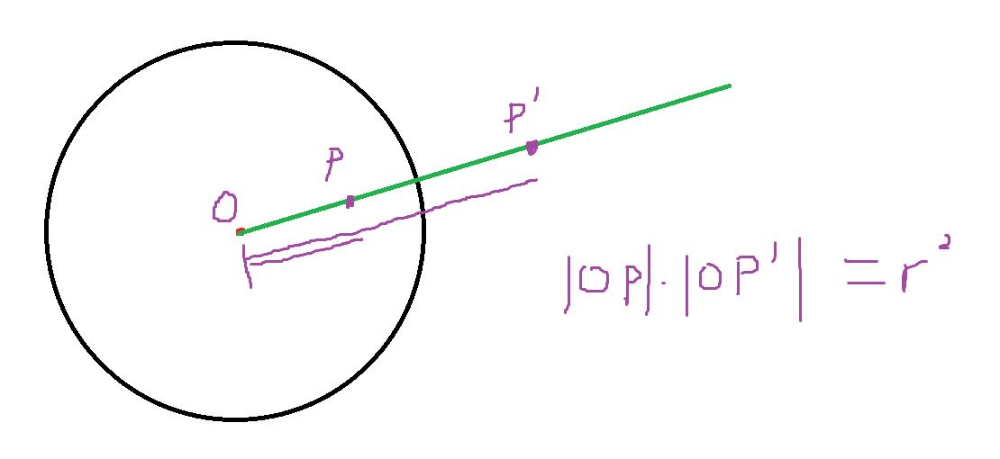
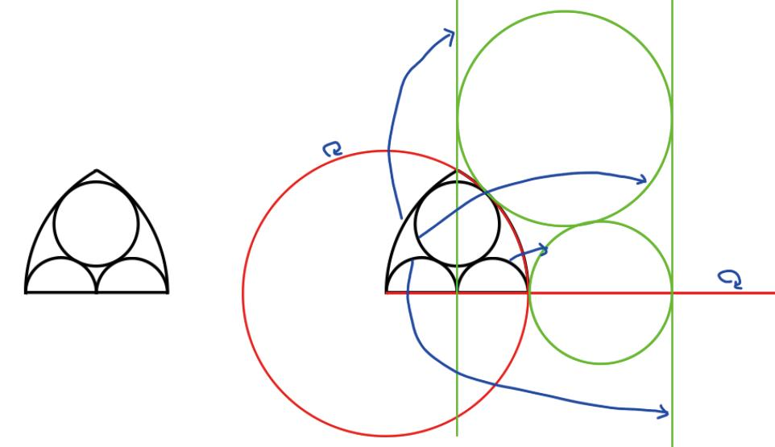

# 数学公式

## 组合数学
### 二项式定理
$$ (x+y)^n = \sum_{k=0}^n \binom{n}{k}x^k y^{n - k} $$

### 吸收恒等式
$$ k\binom{r}{k} = r\binom{r-1}{k-1} $$

### 加法公式
$$ \binom{r}{k} = \binom{r-1}{k} + \binom{r-1}{k-1} $$

$$ \sum_{k=0}^n \binom{r+k}{k} = \binom{r+n+1}{n} $$

$$ \sum_{k=0}^n \binom{k}{m} = \binom{n+1}{m+1} $$

### 上指标反转
$$ \binom{r}{k} = (-1)^k \binom{k-r-1}{k} $$

### 范德蒙德卷积
$$ \sum_{k=0}^n \binom{r}{k}\binom{s}{n-k} = \binom{r+s}{n} $$

### 幂函数展开为斯特林数
$$ i^K = \sum_{j=0}^K \left\{ K\atop j \right\} i^{\underline{j}} $$

### 卡特兰数
$$ C_n = \binom{2n}{n} - \binom{2n}{n - 1} $$

### 错位排列
$$ D_n = (n-1)(D_{n-1}+D_{n-2}) $$

### Lucas定理
$$ \binom{n}{m} \equiv \binom{\lfloor\frac{n}{p}\rfloor}{\lfloor\frac{m}{p}\rfloor}\binom{n \mod p}{m \mod p} \mod p $$

### 二项式反演公式
$$ f(n) = \sum_{k=0}^{n} \binom{n}{k} g(k) \rightarrow g(n) = \sum_{k=0}^{n} (-1)^{n-k} \binom{n}{k} f(k) $$

$$ f(n) = \sum_{k=n}^{m} \binom{k}{n} g(k) \rightarrow g(n) = \sum_{k=n}^{m} (-1)^{k-n} \binom{k}{n} f(k) $$

## 数论
### 狄利克雷卷积
$$ h(n) = \sum_{d|n}f(d)g(\frac{n}{d}) $$

如果 $f$ 和 $g$ 是积性函数，则 $h$ 是积性函数

### 莫比乌斯反演
$$ \displaystyle F(n)=\sum_{d|n}f(d)\leftrightarrow f(n)=\sum_{d|n}\mu(d)F(\frac{n}{d}) $$

$$ f*1=F\leftrightarrow f=F*\mu $$

## 矩阵

### 构造增广状态转移矩阵
|                           问题                            |                              转移矩阵                               |                               初始值                               |           结果           |
|:-------------------------------------------------------:|:---------------------------------------------------------------:|:---------------------------------------------------------------:|:----------------------:|
|       $\displaystyle\sum_{k=0}^{n} (aB^k)_{i,j}$        | $T = \begin{bmatrix}B & 0 \\e_j \cdot e_i^T & 1 \end{bmatrix}$  |         $z_0 = \begin{bmatrix} a \\ a_i \end{bmatrix}$          |    $z_n = T^n z_0$ 的**最后一个分量**     |
| $\displaystyle\sum_{k=0}^{n} \langle u, B^k v \rangle$  |      $T = \begin{bmatrix} B & 0 \\ u^T & 1 \end{bmatrix}$       | $z_0 = \begin{bmatrix} v \\ \langle u, v \rangle \end{bmatrix}$ | $s_n = T^n z_0[back] $ |
|             $\displaystyle\sum_{i=0}^n A^i$             |       $T = \begin{bmatrix} A & I \\ 0 & I \end{bmatrix}$        |                                无                                | $ T^{n+1} $ 的**右上角分块** |

## 计算几何
### 反演

原来相切的图形反演后仍相切，原来对称的图形反演后仍对称，据此可以用于解决一系列相切问题